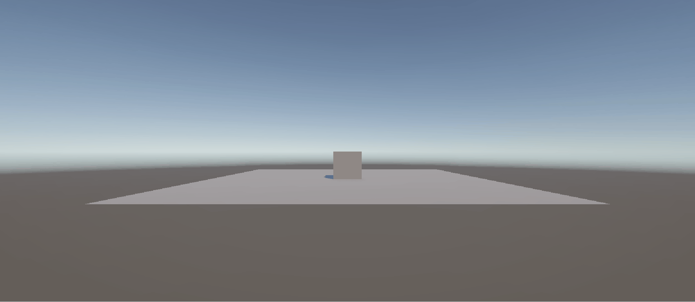
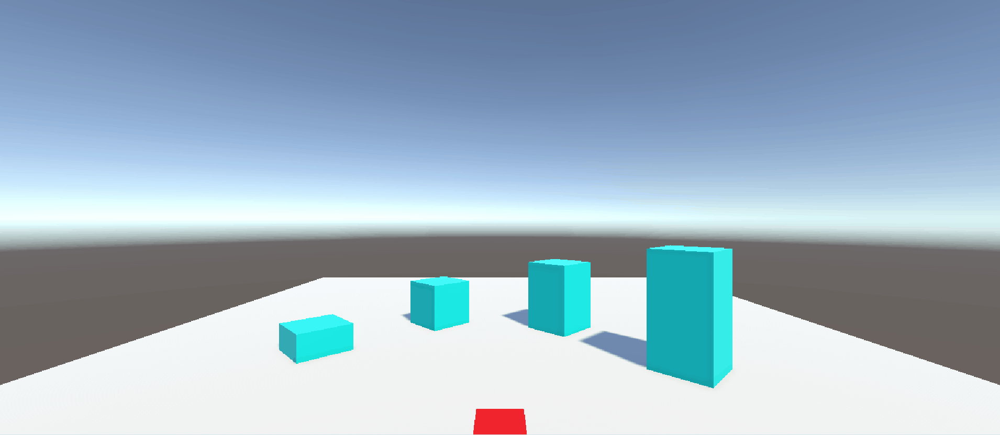

# Tutorial

## Tutorial 0
  
[Link to script](https://github.com/Shirge/Tutorial/blob/main/Tutorial/Assets/Scripts/LaunchCube.cs)

## Tutorial 1
  
[Link to script](https://github.com/Shirge/Tutorial/blob/main/Tutorial/Assets/Scripts/CharacterAnimation.cs)

## Tutorial 2
  
Links to scripts  
[Animation](https://github.com/Shirge/Tutorial/blob/main/Tutorial/Assets/Scripts/WalkingAnimation.cs)  
[Basic Movement](https://github.com/Shirge/Tutorial/blob/main/Tutorial/Assets/Scripts/MoveBasic.cs)  
[Basic Movement (No turning)](https://github.com/Shirge/Tutorial/blob/main/Tutorial/Assets/Scripts/MoveNoTurn.cs)

## Tutorial 3

[Link to the script](https://github.com/Shirge/Tutorial/blob/main/Tutorial/Assets/Scripts/Movement.cs)

## Tutorial 4

[Link to the script](https://github.com/Shirge/Tutorial/blob/main/Tutorial/Assets/Scripts/GetPickup.cs)
